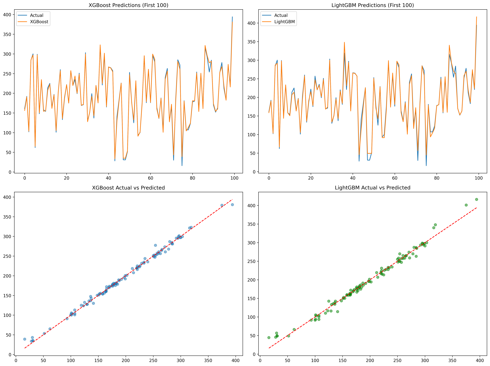
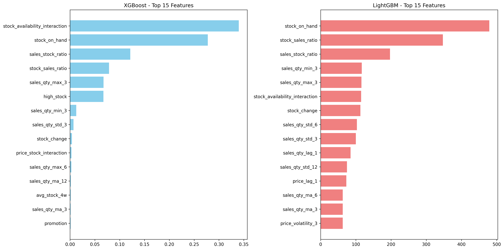
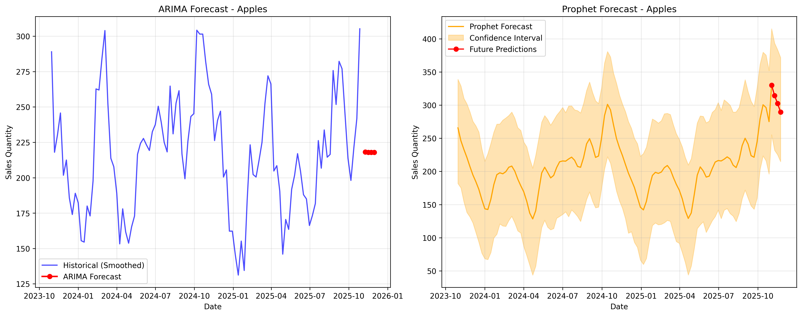

<div align="center">

# 🛒 RetailSense Lite

**Retail demand forecasting, anomaly detection and pricing intelligence in one Streamlit dashboard.**

[](https://github.com/Veladicodes/RetailSense_Lite/actions/workflows/ci.yml)


</div>



## Overview

RetailSense Lite turns weekly sales data into decisions. It forecasts demand per product with a hybrid ensemble, flags unusual sales, warns about stock-outs, and simulates how price changes would move demand and revenue.

## Features

| Area | What it does |
|---|---|
| 📈 **Forecast Explorer** | Hybrid ensemble of Prophet, XGBoost and LightGBM. Horizons from 3 months to 3 years, plus a custom end date. 80% and 95% confidence bands, anomaly overlay and trend changepoints |
| 🧠 **Explainability** | Feature-importance view of forecast drivers, with SHAP when installed and a fallback otherwise |
| 🚨 **Sales anomalies** | Z-score, IQR and Isolation Forest combined, with Mild / Moderate / Severe severity labels |
| 📦 **Inventory alerts** | Low stock, overstock and optimal status, days to stock-out, suggested reorder quantities |
| 🌦️ **Seasonal insights** | Trend decomposition and monthly seasonality patterns |
| 💰 **Pricing** | Price elasticity, opportunity ranking and a what-if price slider (−20% to +20%) with promotion and holiday toggles |
| ⚙️ **Dynamic pricing engine** | Multi-product price optimisation with profit-gain estimates |
| 📤 **Exports** | CSV, JSON metrics and text insight reports |

<table>
<tr>
<td></td>
<td></td>
</tr>
<tr>
<td align="center"><sub>Feature importance of the forecasting model</sub></td>
<td align="center"><sub>Baseline forecast comparison</sub></td>
</tr>
</table>

## How the forecast works

1. **Prophet** captures long-term trend and seasonality.
2. **XGBoost** and **LightGBM** learn short-term patterns from engineered features.
3. The models are blended using weights derived from validation error.
4. Cross-validation produces the error metrics (RMSE, MAE, MAPE, R²) shown in the dashboard.

If Prophet isn't installed the engine falls back to the remaining models.

## Sample result

One documented run on a single product ("Apples", 13-week horizon) gave an ensemble **RMSE ≈ 38.85, MAE ≈ 29.09, R² ≈ 0.77**. This is a sample from the project's own test script, not a benchmark across products or datasets. See [README/PLACEMENT_NOTES.md](README/PLACEMENT_NOTES.md) for the original notes.

## Quick start

```bash
git clone https://github.com/Veladicodes/RetailSense_Lite.git
cd RetailSense_Lite
python -m venv venv
venv\Scripts\activate          # Windows; use `source venv/bin/activate` on Linux/macOS
pip install -r requirements.txt
streamlit run app.py
```

The dashboard opens at `http://localhost:8501`. `launch_dashboard.py` can also check and install requirements for you.

### Bring your own data

The repository ships the code but **not the dataset**. The dashboard expects a feature table at `data/processed/data_with_all_features.csv`, which the Phase 1–2 pipeline notebooks generate from your raw sales data. Required columns:

| Column | Type | Needed for |
|---|---|---|
| `week_start` | date | all features |
| `product_name` | string | all features |
| `sales_qty` | numeric | all features |
| `price` | numeric | pricing features (optional) |
| `stock_on_hand` | numeric | inventory features (optional) |

Products need at least 8 weeks of history to be forecast.

## Project structure

```
app.py                     Streamlit dashboard
launch_dashboard.py        setup and launch helper
models/                    baselines, feature engineering, forecasting, anomaly detection
utils/                     ensemble forecasting, business insights, pricing engine, data loading
notebooks/                 Phase 1 EDA, Phase 2 core models, Phase 3, Phase 4 dynamic pricing
utils/tests/               forecast flow test script
```

## Tech stack

Python · pandas · NumPy · scikit-learn · XGBoost · LightGBM · Prophet · statsmodels · Optuna · SHAP · Plotly · Streamlit

## Author

**Adithya A**: [LinkedIn](https://www.linkedin.com/in/adithya-a-ml/) · [GitHub](https://github.com/Veladicodes)
